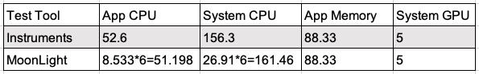
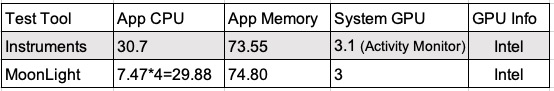

# MoonLight

*English | [中文](README.zh.md)*

## What is MoonLight？

MoonLight is a performance test kit for iOS/macOS app which can be integrated into your app to implement performance data captured easily. MoonLight can provide App CPU, System CPU, App Memory, System GPU and GPU info accuratly. 

## Why named it as MoonLight?

We name it as **MoonLight** because we hope the kit can make test easy and efficient, just like the tranquil moonlight guides wanderers in the dark night and gives us a feeling of serenity and comfort.

MoonLight has low performance consumption and is easy to use. The performance data captured by MoonLight is accurately. It will help dev team locate the performance problems more quickly and accurately to promote the performance optimization. Help test team get performance data faster and more accurately to improve test efficiency.

## Comparison
### Instruments
The peformance data captured by MoonLight is the same as Instruments. The specific advantages and disadvantages are as follows.

1. Instruments can not be implemented to performance test automation and can not get the specific data to be analysed scientifically. By comparison, MoonLight can provide the performance data accuratly and can support to implement performance test automation.

2. Instruments can not to be implemented to test remotely. You can not test your app in your home while the device in your company. Therefore, you can not test plenty of devices at the same time. By comparison, MoonLight can support it.

3. Low system iOS devices cannot by tested on the latest version Insturuments. By comparison, MoonLight do not have the limitaion.

4. Insturments on macOS do not support gpu captureing. By comparison, MoonLight supports. The Moonlight's gpu info is the same as the activity monitor on macOS.

5. Instruments also have advantages, such as the Allocations and Leaks to provide memory leaks testing. Instruments can also provide data visualization. By comparison, MoonLight is programmable. Developers can use MoonLight to implement data visualization and automated test need.
 
### GT
GT is an opensource performance test project from Tencent. And GT also has many disvantages.

1. GT is not support macOS. By comparison, MoonLight supports.

2. GT's App Memory is not the same as Instruments. And GT can not output GPU and System CPU. By comparison, MoonLight supports.

3. When GT is integrated in user's app, the app should add too many dependent frameworks and should disable Bitcode support. Moreover, GT‘s package size is much bigger than MoonLight. MoonLight needs to add only one framework on iOS and does not need to add any framework on macOS.

### Perfdog
Perfdog is a closed source performance test tool from Tencent. And it does have many disvantages.

1. Perfdog cannot sppport macOS.

2. Perfdog is not a automated performance test tool. It need user to point UI button to start or stop performance testing. Perfdog's advantage is data visualization.

3. Perfdog is not an open source project. And it did have serious bug on iOS14 that the App CPU captured by Perfdog is wrong. If use Perfdog to test your app, maybe you will find a new serious bug in the future, because we do not konw Pefdog's source code.

## Requirements
- iOS 8.0+
- macOS 10.11+

## Installation

### Cocoapods
- iOS:

Warning! For iOS, do not use it on AppStore release. Recommend use it on debug mode.

```
pod 'MoonLight_iOS', :configurations => ['Debug']
```

- macOS:

```
pod 'MoonLight_macOS'
```

## Usage

```
// Step1: create MoonLight instance and set sampling interval.
	_moonLight = [[MoonLight alloc]initWithDelegate:self timeInterval:1];

// Step2: start timer.
	[_moonLight startTimer];


// Step3: through the callback, you can get all the performance data per interval.
- (void)captureOutputAppCPU:(float)appCPU systemCPU:(float)systemCPU appMemory:(float)appMemory gpuUsage:(float)gpuUsage gpuInfo:(NSString *)gpuInfo {
	NSLog(@"appMemory:%f", appMemory);
	NSLog(@"appCPU:%f", appCPU);
	NSLog(@"gpuUsage:%f", gpuUsage);
	NSLog(@"systemCPU:%f", systemCPU);
	NSLog(@"gpuInfo:%@", gpuInfo);
}

// Step4：if you want to stop capturing the performance data, use "stopTimer".
	[_moonLight stopTimer];

```

## Test Result
The performance consumption of MoonLight is very low. It's almost negligible. And the output is stable under the same environment. App CPU, System CPU, App Memory and iOS GPU are the same as Instruments and the macOS GPU is the same as Activity Monitor.
### MoonLight VS Instruments
- iOS



- macOS



Comment：CPU(MoonLight) = CPU(Instruments) / Core Num

### The Perforamnce Consumption of MoonLight
Test case: Use Instruments, Open your app, enable MoonLight detection and get the performance data1. Than, open your app again, do not enable MoonLight detection and get the performance data2. And the performance consumption = data2 - data1.

- iOS

App Memory = 7.38 - 7.34 = 0.04Mb, App CPU = （2.1%-0.1%）/ （6 core） = 0.33%, GPU = 0%.

Device: iPhone XS iOS14.2 , Core number: 6

- macOS

App Memory = 14.42-14.36 = 0.06Mb, App CPU = (0.08% - 0.0%) / (4 core) = 0.02%, GPU = 0%.

Device: Macbook Pro 2017 13.3 Intel i5 , System: BigSur 11.0.1


## Author
Echoo J

Email: liujunjie@agora.io

## License
MoonLight is available under the MIT license. See the LICENSE file for more info.