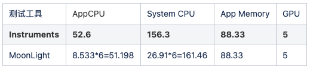
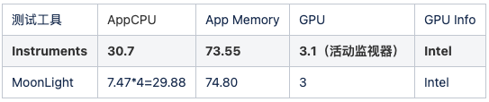

# MoonLight

*[English](README.md) | 中文*

## 什么是MoonLight？
MoonLight是iOS/Mac上的性能测试组件，它可以单独集成在任何App中实现自动化性能数据的采集，你可以非常轻松的获取到App CPU、System CPU、App Memory、System GPU 以及 GPU Info的数据。

## MoonLight的命名

**MoonLight**，它的中文意思名为**月光**。月光弥漫在地球之上是宁静且自然的，月光会给予地球上的人们以指引。而月光的寓意恰好和我们开发性能测试组件的出发点相契合。

我们希望iOS/Mac的性能测试也能像月光一样，轻松且自然。MoonLight有着更低的性能消耗，更容易的使用方式，更精准的性能数据。它将帮助开发团队更快速更精确的定位性能问题，进而推动性能优化和提升。帮助测试团队更快更准的获取性能数据，提升测试效率。

## 对比其他的性能测试工具
### Instruments
MoonLight采集到的性能数据是基本和Instruments保持一致的。具体的优劣对比如下：

1. Instruments无法实现性能自动化,无法将获取到的性能数据提取出来进行分析，最后提供出去的性能数据准确度不够，存在人为误差。MoonLight可以解决这个问题。

2. Instruments无法实现远程性能测试，自然也无法实现高并发的性能测试，通常来说需要一台设备连接USB线后测试，然后一台测试完再测试下一台。MoonLight可以一次性测试非常多台，也没有必须连接数据线的要求。

3. 高版本的Instruments无法测试一些低端系统机器的性能，MoonLight可以完美支持。

4. 对于Mac, Instruments是不支持GPU的输出，MoonLight支持。进过测试，GPU的输出和Mac自带的活动管理器GPU输出保持一致。

5. Instruments优点是数据可视化，并且可以提供内存泄漏测试。MoonLight暂时不提供数据可视化，但是由于MoonLight是可编程的，当开发者拿到相关的性能数据后, 可以自行实现数据上报或者可视化的处理。

### GT
1. GT 不支持Mac的性能测试，MoonLight支持。

2. GT 采集到的App Memory数据和Instruments是不一致的。GT 无法输出 GPU、System CPU, 但是MoonLight可以。

3. GT集成到App中，需要添加非常多的依赖库，取消掉Bitcode支持，自身也比较庞大，并且会增加App的包大小。MoonLight更轻量化，对于iOS仅仅只需要增加一个系统库，对于Mac不需要增加任何的系统库。 

### Perfdog
1. Perfdog无法支持Mac的性能测试。

2. Perfdog并非是一个自动化的性能测试工具，优点是数据可视化。

3. Perfdog并非是一个开源的测试工具，之前在iOS 14上出现过App CPU不准的Bug, 而我们也并不清楚其实现的原理和代码，未来依旧有可能在某些系统上出现性能项测试不准的情况。

## Requirements
- iOS 8.0+
- macOS 10.11+

## Installation

### Cocoapods
- iOS:

Warning! For iOS, do not use it on AppStore release. Recommend use it on debug mode.

```
pod 'MoonLight_iOS', :configurations => ['Debug']
```

- macOS:

```
pod 'MoonLight_MacOS'
```

## Usage

```
// Step1: create MoonLight instance and set sampling interval.
	_moonLight = [[MoonLight alloc]initWithDelegate:self timeInterval:1];

// Step2: start timer.
	[_moonLight startTimer];


// Step3: through the callback, you can get all the performance data per interval.
- (void)captureOutputAppCPU:(float)appCPU systemCPU:(float)systemCPU appMemory:(float)appMemory gpuUsage:(float)gpuUsage gpuInfo:(NSString *)gpuInfo {
	NSLog(@"appMemory:%f", appMemory);
    NSLog(@"appCPU:%f", appCPU);
    NSLog(@"gpuUsage:%f", gpuUsage);
    NSLog(@"systemCPU:%f", systemCPU);
    NSLog(@"gpuInfo:%@", gpuInfo);
}

// Step4：if you want to stop capturing the performance data, use "stopTimer".
	[_moonLight stopTimer];

```

## MoonLight 自测的结果
iOS/Mac MoonLight 自身的性能消耗非常低，几乎可以忽略不计；测试的过程中，性能输出稳定；App CPU、System CPU、App Memory、GPU 可以和Instruments或者活动监视器结果保持一致。

### 一、MoonLight VS Instruments
- iOS



- macOS



备注：MoonLight对CPU有做归一化处理. CPU(MoonLight) = CPU(Instruments) / 核心数

### 二、MoonLight 自身的性能消耗
测试case: 打开App，打开MoonLight的检测，测试性能data1。打开App, 不打开MoonLight的检测，测试性能data2。性能消耗 = data1 - data2

- iOS

App Memory 消耗 = 7.38-7.34 = 0.04Mb ；App CPU 消耗 = （2.1%-0.1%）/ （6核） = 0.33% ；GPU = 0% ，并且整个性能测试阶段，数据波动稳定，不会出现MoonLight的开启造成性能有不稳定变化。

测试设备：iPhone XS iOS 14.2 六核

- macOS

App Memory 消耗 = 14.42-14.36 = 0.06Mb ；App CPU 消耗 = （0.08%-0.0%）/ （4核） = 0.02% ；GPU = 0% ，并且整个性能测试阶段，数据波动稳定，不会出现MoonLight的开启造成性能有不稳定变化。

测试设备：Macbook Pro 2017 13.3 Intel i5 , System: BigSur 11.0.1

## Author
Echoo J

Email: liujunjie@agora.io

## License
MoonLight is available under the MIT license. See the LICENSE file for more info.